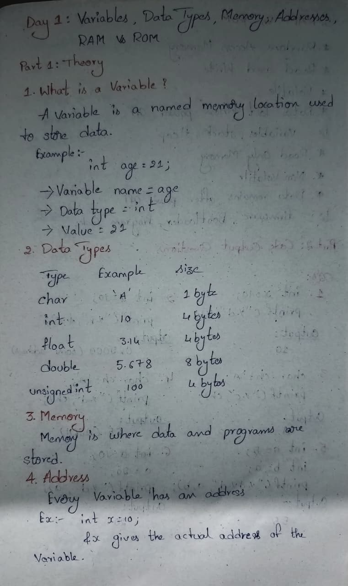
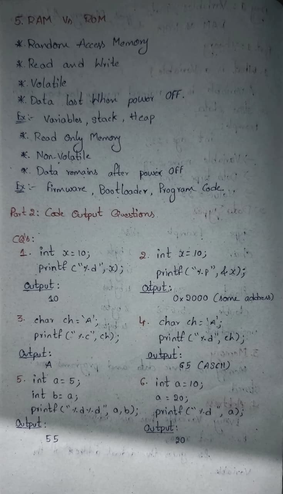
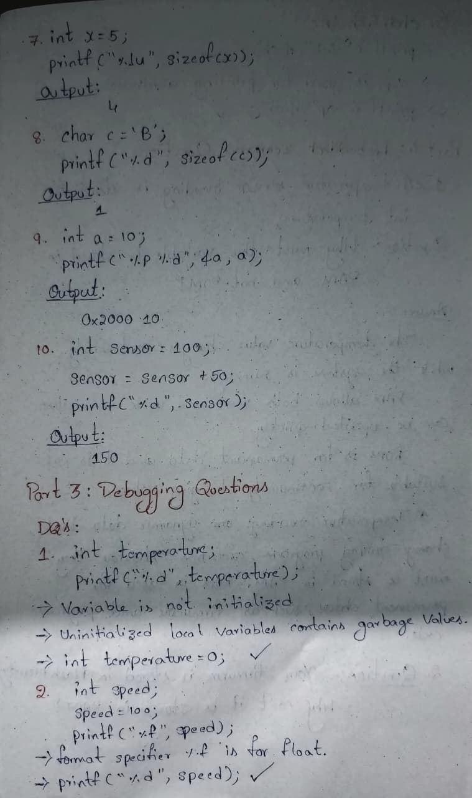
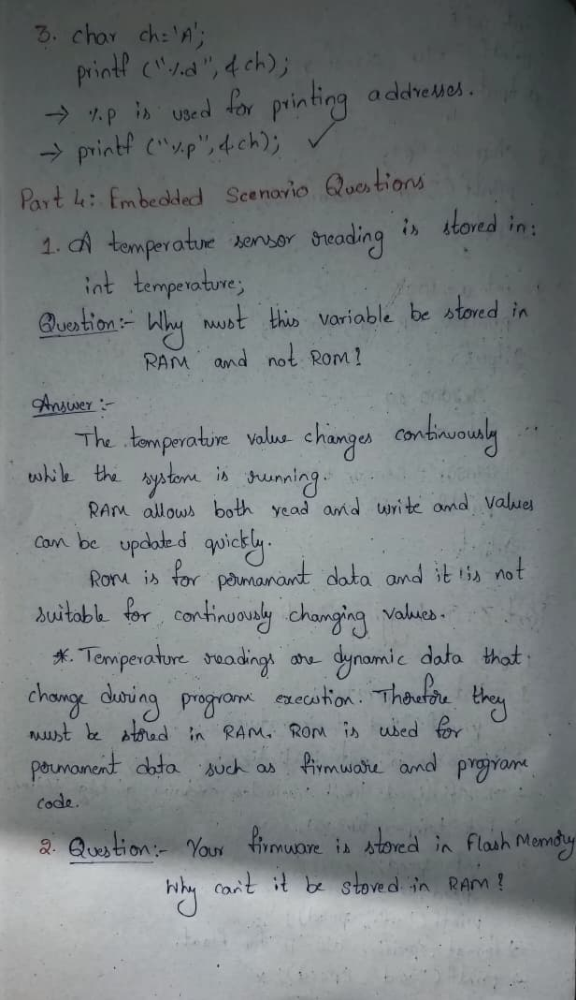
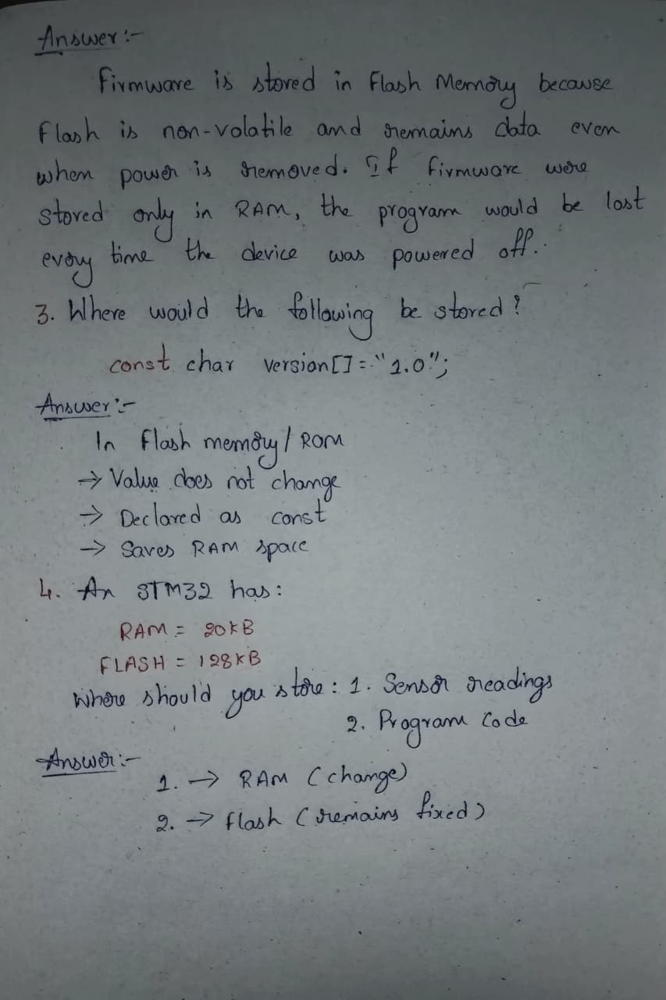

# Day 1: Variables, Data Types, Memory, Addresses & RAM vs ROM

## Topics Covered

### 1. Variables
- Definition of variables
- Variable declaration and initialization
- Example:
```c
int age = 21;
```

### 2. Data Types
Studied commonly used C data types:

| Data Type | Example | Typical Size |
|------------|----------|-------------|
| char | 'A' | 1 Byte |
| int | 10 | 4 Bytes |
| float | 3.14 | 4 Bytes |
| double | 5.678 | 8 Bytes |
| unsigned int | 100 | 4 Bytes |

### 3. Memory
- Memory stores data and programs.
- Variables occupy memory locations.

### 4. Address
- Every variable has a memory address.
- Address can be accessed using the `&` operator.

Example:

```c
int x = 10;
printf("%p", &x);
```

### 5. RAM vs ROM

| RAM | ROM |
|------|------|
| Read & Write | Read Only |
| Volatile | Non-Volatile |
| Data lost after power OFF | Data retained after power OFF |
| Stores variables during execution | Stores firmware and program code |

---

## Code Output Practice

Completed 10 output prediction questions covering:

- Variables
- Memory addresses
- ASCII values
- sizeof() operator
- Variable assignment
- Data modification

---

## Debugging Practice

Solved debugging problems related to:

- Uninitialized variables
- Incorrect format specifiers
- Address printing

---

## Embedded System Concepts

### Sensor Data Storage

Sensor readings should be stored in RAM because:

- Values change continuously
- RAM supports fast read/write operations

### Firmware Storage

Firmware should be stored in Flash Memory because:

- Flash is non-volatile
- Program remains available after power loss

### STM32 Memory Usage

Example:

- RAM = 20 KB
- Flash = 128 KB

Storage:

- Sensor Data → RAM
- Program Code → Flash

---

## Learning Outcome

Today I learned:

✅ Variables and data types in C

✅ Memory and addresses

✅ RAM vs ROM concepts

✅ Code output prediction

✅ Debugging basics

✅ Memory usage in Embedded Systems

---

## Notes

### Page 1


### Page 2


### Page 3


### Page 4


### Page 5


---

**Day 1 Completed 🚀**
